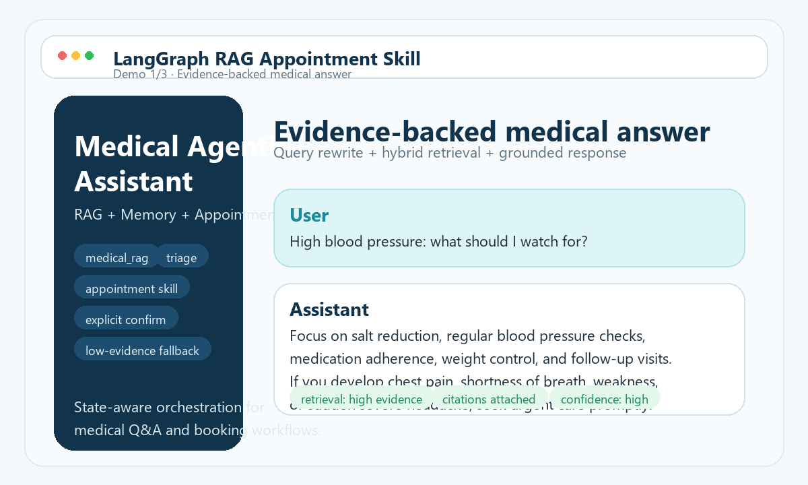

<div align="center">

# Medical Agentic Assistant

**A stateful medical RAG assistant built with LangGraph, hybrid retrieval, session memory, and semi-controlled appointment skills.**

[](https://www.python.org/)


[](LICENSE)


**Medical QA · Triage · Appointment Skill · Cancellation Workflow · Low-Evidence Safety Fallback**

[Quick Start](#quick-start) • [Benchmark Snapshot](#benchmark-snapshot) • [Architecture](#architecture-overview) • [Documentation](#documentation)

</div>



> Illustrated workflow demo only. This GIF is a concept-style capability preview, not a live recording of the current UI.

This project is designed to feel closer to a **real assistant product** than a single-path RAG demo:

- medical questions are routed through a retrieval-aware answer pipeline
- appointment and cancellation are handled as **controlled skills**, not free-form tool writes
- conversation state survives interruptions, clarifications, and pending confirmations
- when evidence is weak, the assistant can still answer with a **clearly labeled general-medical fallback**

> The public UI is still evolving. To keep the repository homepage stable, the illustrated demo above focuses on product behaviors and backend capabilities rather than a fast-changing frontend skin.

## Why This Repo Is Interesting

Most RAG demos stop at "upload files, ask questions."

This project goes further by combining:

- **medical question answering**
- **stateful workflow execution**
- **session memory and interruption recovery**
- **retrieval quality evaluation**
- **controlled appointment actions instead of free-form tool writes**

That makes it closer to a real assistant product than a single-path chatbot demo.

## Highlights

| Area | What this project does |
|------|-------------------------|
| **Routing** | Uses LangGraph to unify `medical_rag`, `triage`, `appointment`, `cancel_appointment`, clarification recovery, and pending-state continuation |
| **Memory** | Combines Redis short-term context, conversation summary, topic focus, and persisted workflow state |
| **Retrieval** | Uses parent-child chunking, dense+sparse hybrid retrieval, query rewrite, RRF fusion, rerank, and grounding checks |
| **Workflow safety** | Treats booking/cancellation as a controlled skill with `preview -> explicit confirm -> execute` |
| **Fallback behavior** | If evidence is weak, the system can still answer general medical questions with a visible disclaimer instead of hard refusal |
| **Evaluation** | Includes in-repo benchmark and regression scripts for routing, retrieval, memory, and answer quality |

## Benchmark Snapshot

Current benchmark snapshots included in this repository:

- **Long-dialogue token efficiency**
  - hybrid memory reduced prompt tokens by **27.4% at P95**
- **Retrieval precision**
  - on the bundled NHC/WHO-style benchmark setup, **Precision@5 improved from 0.68 to 0.83**

Related benchmark entrypoints:

- `project/benchmarks/evaluate_memory_token_benchmark.py`
- `project/benchmarks/evaluate_medical_rag_benchmark.py`
- `project/benchmarks/evaluate_offline_answer_benchmark.py`
- `project/benchmarks/evaluate_acceptance_report.py`

## Core Capabilities

### 1. Medical RAG

- answers medical questions against a local knowledge base
- supports rewrite, retrieval fusion, rerank, and evidence-aware answer generation
- degrades gracefully to a conservative general-medical answer when retrieval evidence is weak

### 2. Triage and Department Recommendation

- supports symptom-to-department guidance
- can reuse recommended department context in later booking turns

### 3. Appointment Skill

- supports department / doctor / availability discovery
- supports booking preview and cancellation preview
- requires explicit confirmation before any actual write operation
- keeps pending confirmation state even if the conversation is interrupted

### 4. Multi-Turn Memory

- keeps recent context in session memory
- persists structured workflow state for resume / interruption recovery
- uses summaries to reduce token growth in longer dialogues

## Typical Behaviors

### Medical QA with evidence

```text
User: 高血压应该注意什么？
Assistant: 结合知识库证据给出生活方式、监测和复诊建议，并附来源信息。
```

### Low-evidence fallback

```text
User: 感冒发烧怎么办？
Assistant: 即使检索证据不足，也先提供通用医学信息，并明确说明这次回答未充分基于知识库，仅供一般参考，症状加重需及时就医。
```

### Appointment preview and confirmation

```text
User: 我要挂呼吸内科张医生明天下午的号
Assistant: 先生成预约预览，并要求用户明确回复“确认预约”
User: 确认预约
Assistant: 再执行实际预约写入
```

### Interruption-safe workflow recovery

```text
User: 我要挂呼吸内科张医生明天下午的号
Assistant: 生成预约预览
User: 对了，咳嗽三天了需要拍片吗？
Assistant: 先回答医学问题，同时保留待确认预约状态
User: 确认预约
Assistant: 恢复之前的预约并执行
```

## Architecture Overview

```text
User
  -> ChatInterface
  -> LangGraph analyze_turn / routing
      -> medical_rag
          -> rewrite query
          -> hybrid retrieval
          -> rerank / grounding
          -> answer
      -> triage
          -> department recommendation
      -> appointment skill
          -> discovery
          -> planning / preview
          -> confirm / execute
      -> cancel skill
          -> target resolution
          -> preview
          -> confirm / execute
```

### Key backend areas

- `project/core/`
  - system bootstrap, chat interface, medical source import, observability, evaluation helpers
- `project/rag_agent/`
  - LangGraph nodes, routing logic, prompts, state schemas, retrieval tools
- `project/services/appointment_skill/`
  - appointment discovery, planning, dialog policy, and controlled execution
- `project/db/`
  - PostgreSQL / pgvector storage, route logs, retrieval logs, import history, schema helpers
- `project/memory/`
  - Redis-backed session memory and summary storage
- `project/benchmarks/`
  - benchmark entrypoints and acceptance-style evaluation scripts

## Tech Stack

- **Orchestration**: LangGraph, LangChain
- **LLM / embeddings**: OpenAI-compatible providers, DeepSeek, Ollama-compatible setups
- **Storage**: PostgreSQL, pgvector, Redis
- **Interface**: Gradio
- **Evaluation**: in-repo benchmark and regression scripts

## Project Structure

```text
project/
  app.py                     # app entrypoint
  config.py                  # environment-driven configuration
  core/                      # bootstrap, chat interface, ingestion, observability
  rag_agent/                 # LangGraph graph, nodes, prompts, retrieval tools
  services/appointment_skill/# discovery / planning / action workflow package
  db/                        # schema helpers, vector store, route/retrieval logs
  memory/                    # Redis session memory and summaries
  ui/                        # Gradio app and styling
  benchmarks/                # retrieval, memory, route, answer-quality benchmarks
tests/                       # regression and integration tests
docs/                        # setup notes and supplemental guides
```

## Quick Start

### 1. Create a virtual environment

```powershell
python -m venv venv
.\venv\Scripts\Activate.ps1
pip install -r requirements.txt
```

### 2. Prepare environment variables

```powershell
Copy-Item project\.env.example project\.env
```

Then fill in at least:

- model provider credentials
- PostgreSQL connection settings
- Redis connection settings

### 3. Start required services

You will typically need:

- **PostgreSQL** with pgvector support
- **Redis**
- one configured LLM / embedding provider

### 4. Launch the app

```powershell
.\venv\Scripts\python.exe project\app.py
```

Open:

- [http://localhost:7860](http://localhost:7860)

## Testing and Benchmarks

Basic validation:

```powershell
.\venv\Scripts\python.exe -m compileall project tests
.\venv\Scripts\python.exe -m unittest discover -s tests -v
```

Example benchmark runs:

```powershell
.\venv\Scripts\python.exe project\benchmarks\evaluate_memory_token_benchmark.py --json
.\venv\Scripts\python.exe project\benchmarks\evaluate_medical_rag_benchmark.py --json
.\venv\Scripts\python.exe project\benchmarks\evaluate_acceptance_report.py --json
```

## Data and Knowledge Base Notes

This repo does **not** commit local runtime knowledge-base artifacts such as:

- `markdown_docs/`
- `parent_store/`
- `qdrant_db/`
- `runtime/`

These are treated as disposable local state.

Medical source import helpers and manifests live under:

- `project/import_medical_sources.py`
- `project/core/medical_source_ingest.py`
- `project/core/manifests/`

## Documentation

English:

- [Medical Import Guide](docs/MEDICAL_IMPORT.md)
- [Medical Sources Guide](docs/MEDICAL_SOURCES.md)
- [project/README.md](project/README.md)

Chinese:

- [项目导读](docs/PROJECT_GUIDE_CN.md)
- [项目时序图与流程走读](docs/PROJECT_SEQUENCE_CN.md)
- [PostgreSQL 初始化说明](docs/POSTGRES_SETUP_CN.md)
- [评测说明](docs/QA_EVAL.md)

## Safety and Scope

This repository is an **engineering demo for medical information assistance and workflow orchestration**.

It is **not** a medical device and does **not** replace licensed clinicians or in-person diagnosis.

The assistant is designed to:

- prioritize safer wording for high-risk symptoms
- require explicit confirmation before appointment writes
- provide disclaimer-backed fallback answers when knowledge-base evidence is weak

## What Makes It Different From a Typical RAG Demo

- it supports **stateful business actions**, not only retrieval
- it preserves **pending confirmations** across unrelated turns
- it separates **discovery**, **planning**, and **execution** for appointment workflows
- it includes **low-evidence fallback behavior** instead of only refusal
- it ships with **benchmark scripts and regression coverage** beyond chat happy paths

## Roadmap

- better public demo setup and sample data
- stronger answer-level evaluation and reporting
- more polished public-facing UI
- deeper appointment / reschedule skill modularization

## Contributing

If you want to contribute, start here:

- [CONTRIBUTING.md](CONTRIBUTING.md)
