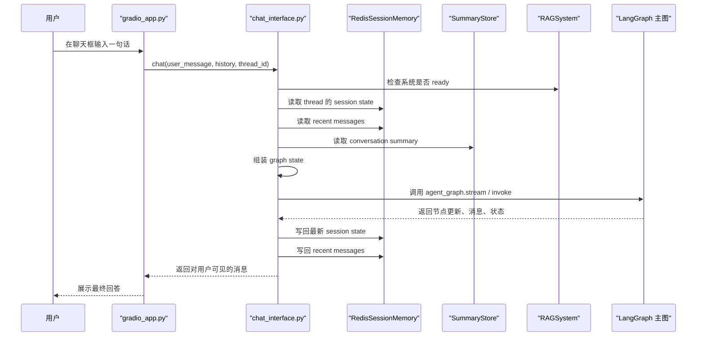
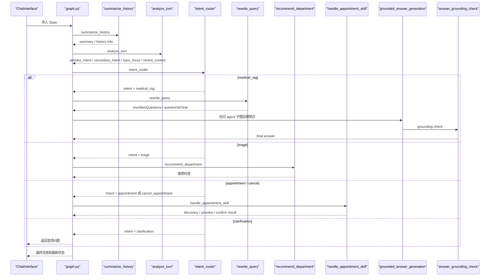
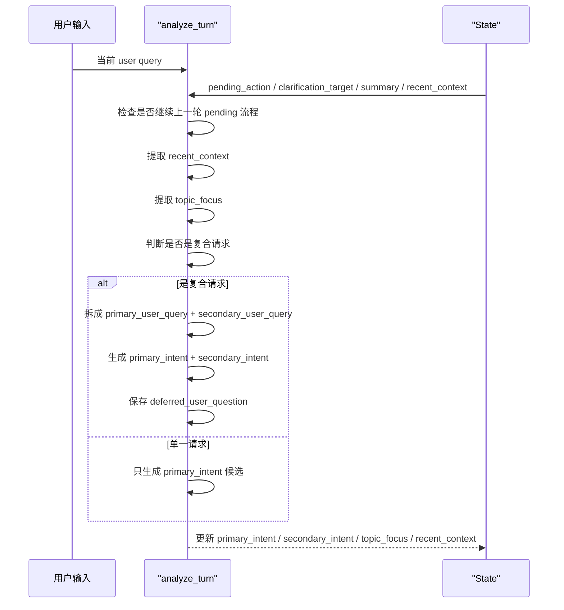
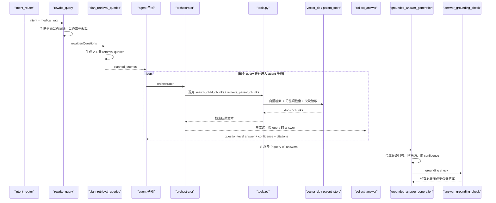
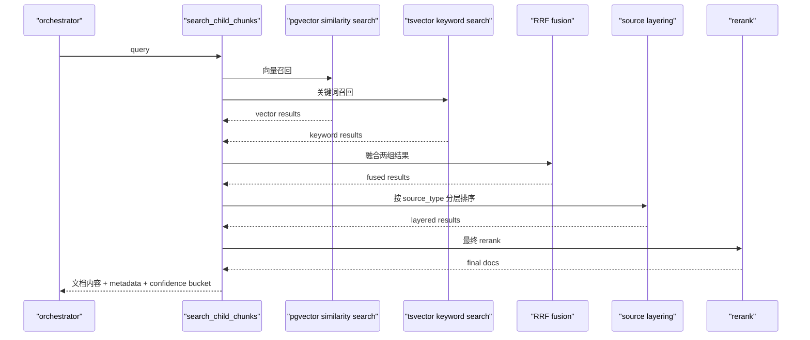
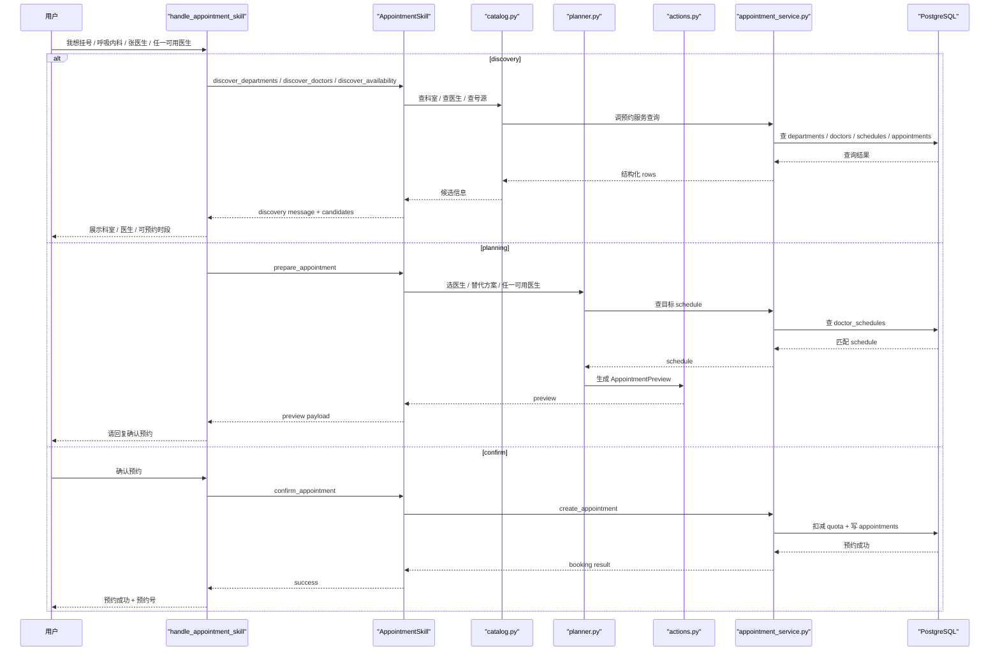
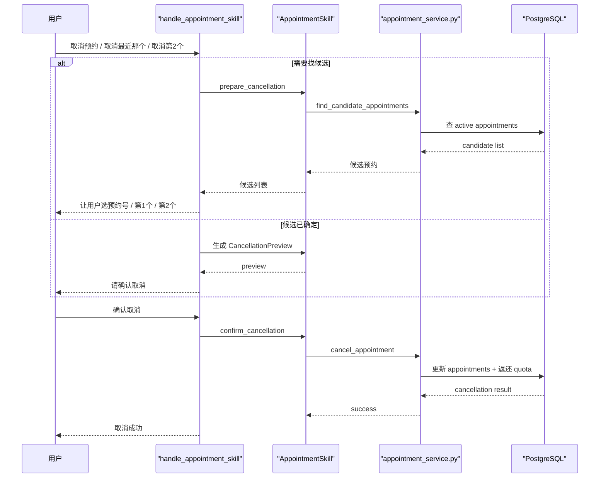
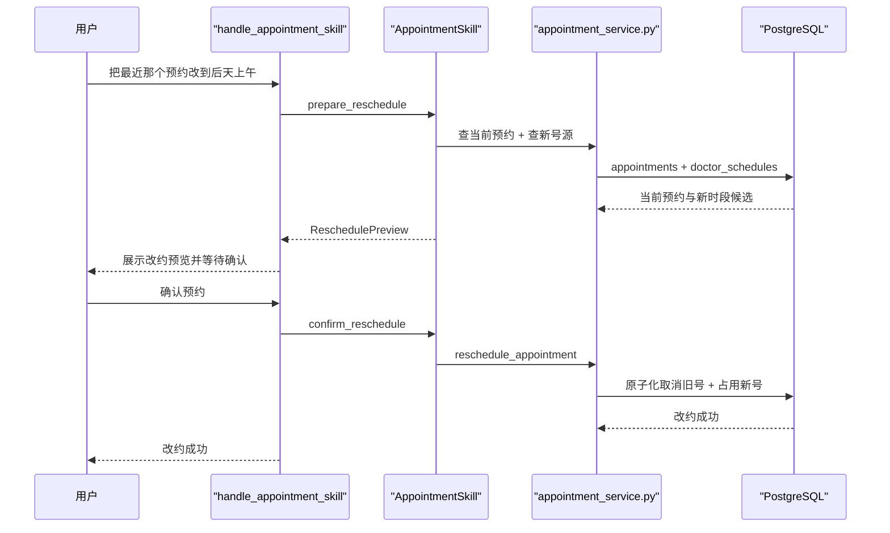
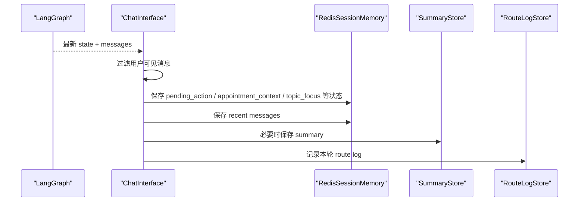
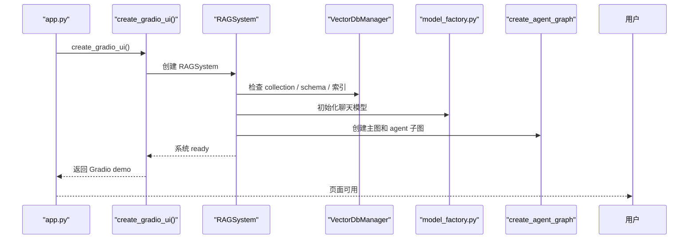

# 项目时序图导读（中文）

这份文档专门用时序图解释项目，不再按目录讲，而是按“用户发一句话之后，系统内部怎么流转”来讲。

建议配合下面这些文件一起看：

- `D:\nageoffer\agentic-rag-for-dummies\project\core\chat_interface.py`
- `D:\nageoffer\agentic-rag-for-dummies\project\rag_agent\graph.py`
- `D:\nageoffer\agentic-rag-for-dummies\project\rag_agent\edges.py`
- `D:\nageoffer\agentic-rag-for-dummies\project\rag_agent\nodes.py`
- `D:\nageoffer\agentic-rag-for-dummies\project\rag_agent\tools.py`
- `D:\nageoffer\agentic-rag-for-dummies\project\services\appointment_skill\__init__.py`
- `D:\nageoffer\agentic-rag-for-dummies\project\services\appointment_service.py`

---

## 1. 总览：一次消息从前端进入系统

### 这张图对应什么代码

- UI 入口：`D:\nageoffer\agentic-rag-for-dummies\project\ui\gradio_app.py`
- 会话编排：`D:\nageoffer\agentic-rag-for-dummies\project\core\chat_interface.py`
- 系统总装配：`D:\nageoffer\agentic-rag-for-dummies\project\core\rag_system.py`

### 理解重点

- 前端本身不做业务判断。
- `ChatInterface` 是“请求总编排器”。
- 真正决定“走哪条业务链”的，是 LangGraph 主图。

---

## 2. 主图：用户一句话进入后怎么被路由

### 这张图的意义

这张图说明主图并不是一上来就 RAG。

它一定先做两步：

1. `analyze_turn`
2. `intent_router`

也就是说，你可以把整个后端理解成：

- 先判断“这轮到底在干嘛”
- 再进入正确业务分支

---

## 3. `analyze_turn` 到底做了什么

### 为什么它重要

`analyze_turn` 是这个项目里最容易“看不见但很关键”的节点。

它不是直接回答问题，而是帮系统做三件特别重要的事：

- 记住你现在是不是还在某个预约/取消流程里
- 记住这一轮的主题是什么
- 把一句话里的两件事拆开

例如：

- “取消刚才那个预约，然后我这个咳嗽还要看吗”

它会拆成：

- 主意图：取消预约
- 次意图：医学问答

---

## 4. 医学问题：RAG 路线怎么走

### 医学问答这条线最关键的 5 件事

1. **不是只查一次**  
   `plan_retrieval_queries` 会生成多条检索表达。

2. **不是只做向量检索**  
   还会做关键词检索，然后用 RRF 融合。

3. **有来源分层**  
   会优先考虑：
   - `patient_education`
   - `public_health`
   - `clinical_guideline`

4. **有证据强度**  
   最终会给：
   - `high`
   - `medium`
   - `low`
   - `no_evidence`

5. **没证据也不一定拒答**  
   医学问题在 `no_evidence / low` 时，可以进入“通用医学信息回答”模式，但会带安全提醒。

---

## 5. 检索层内部是怎么做的

### 为什么不是“只向量搜索一下”

因为这个项目要解决两类问题：

- 语义相近
- 术语精确命中

所以它用了：

- 向量检索解决“相近语义”
- 关键词检索解决“精确匹配”
- RRF 解决“如何把两种结果合起来”

---

## 6. 预约发现到确认：挂号流程怎么走

### 这条链的关键思想

不是“模型直接挂号”，而是：

- 先 discovery
- 再 planning
- 再 confirm

这就是现在项目里的“半受控 Function Calling”。

---

## 7. 取消预约流程怎么走

---

## 8. 改约流程怎么走

---

## 9. 状态和记忆是怎么回写的

### 可以记住的要点

- Redis 存“当前线程短期状态”
- SummaryStore 存“长一点的摘要”
- RouteLogStore 存“这轮被路由到了哪里”

所以系统不是只靠模型“自己记住”，而是显式维护状态。

---

## 10. 启动时系统是怎么准备的

---

## 11. 你现在最值得记住的 3 张图

如果你不想一次消化太多，建议先只记住这 3 张：

1. **总览图**  
   先知道消息从 UI 进入后，经过 `ChatInterface -> Graph -> Redis/DB`。

2. **医学问答图**  
   先知道 RAG 是：
   - 改写
   - 多 query 检索
   - 融合
   - 聚合
   - grounding

3. **预约图**  
   先知道预约不是一步提交，而是：
   - discovery
   - planning
   - confirm

---

## 12. 你后面如果继续看代码，推荐顺序

配合这份时序图，建议你下一步按这个顺序走读源码：

1. `D:\nageoffer\agentic-rag-for-dummies\project\core\chat_interface.py`
2. `D:\nageoffer\agentic-rag-for-dummies\project\rag_agent\graph.py`
3. `D:\nageoffer\agentic-rag-for-dummies\project\rag_agent\edges.py`
4. `D:\nageoffer\agentic-rag-for-dummies\project\rag_agent\nodes.py`
5. `D:\nageoffer\agentic-rag-for-dummies\project\rag_agent\tools.py`
6. `D:\nageoffer\agentic-rag-for-dummies\project\services\appointment_skill\__init__.py`
7. `D:\nageoffer\agentic-rag-for-dummies\project\services\appointment_service.py`

---

## 13. 一句话总结

这个项目可以一句话概括成：

**用户消息先进入 `ChatInterface`，再由 LangGraph 做统一路由；医学问题走 RAG 质量闭环，挂号相关问题走 Appointment Skill，最终状态和结果落回 Redis / PostgreSQL。**

