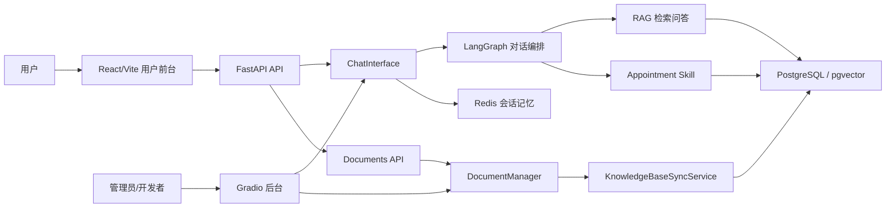

# 前后端分离与后台边界

这个项目现在采用“双入口 + 单核心”的结构：

- React/Vite 是用户端前台，面向真实用户的聊天和轻量知识库操作。
- FastAPI 是用户端 API，负责把前端协议转换成核心服务调用。
- Gradio 是管理员后台，保留诊断、文档管理和开发调试能力。
- `project/core`、`project/rag_agent`、`project/services` 是核心能力层，不直接关心前端形态。



## 用户端 React

位置：`frontend/`

职责：

- 展示用户聊天界面。
- 使用 SSE 接收助手回答。
- 持久化 `thread_id`，刷新后继续当前会话。
- 展示系统状态、知识库状态、官方来源覆盖度。
- 提供安全的文档上传和官方资料同步入口。

它不应该直接暴露：

- LangGraph 内部状态原始 payload。
- 清空数据库、重建全部索引等危险操作。
- route/retrieval 原始调试信息。

## FastAPI API

位置：`project/api/`

职责：

- `routes/chat.py`：聊天 session、history、clear、SSE stream。
- `routes/system.py`：健康检查和系统状态。
- `routes/documents.py`：用户可见的 Documents 状态、列表、上传、官方同步。
- `schemas.py`：API DTO，只暴露前端需要的稳定字段。
- `dependencies.py`：进程内复用 `RAGSystem`、`ChatInterface`、`DocumentManager`。

API 层只做协议适配，不复制 RAG、预约和记忆业务逻辑。

## Gradio 后台

位置：`project/ui/gradio_app.py`

职责：

- 高级诊断。
- 文档上传、官方同步、清空知识库。
- 导入任务、知识库状态和 raw debug 快照。
- 开发调试用聊天入口。

Gradio 不再定位为正式用户端。演示产品体验时优先启动 React 前台。

## 核心服务层

位置：

- `project/core/`
- `project/rag_agent/`
- `project/services/`
- `project/memory/`
- `project/db/`

职责：

- `ChatInterface`：统一聊天入口、流式输出适配、兜底错误处理。
- `RAGSystem`：系统初始化、图编译、知识库状态、后台任务。
- `LangGraph`：路由、RAG、预约、取消、澄清恢复等状态流转。
- `Appointment Skill`：科室/医生/号源发现、预约预览、确认执行、取消/改约。
- `DocumentManager` / `KnowledgeBaseSyncService`：本地/官方文档同步、hash 更新、软删除、索引构建。

## 推荐启动方式

用户端：

```powershell
.\start_frontend_app.ps1 -Restart -SkipInstall
```

后台：

```powershell
.\venv\Scripts\python.exe project\app.py
```

## 后续迁移方向

1. React Documents 页继续补导入任务详情和失败原因展示。
2. route/retrieval 诊断继续留在 Gradio，等用户端稳定后再决定是否迁出。
3. Gradio 最终可以收缩成纯管理控制台，不再承担用户聊天演示。
